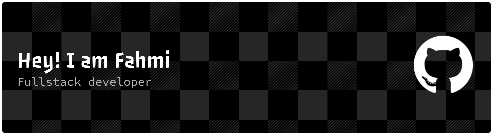

<h2 align="left">👨‍💻 About Me</h2>

💻 Fullstack Developer (Java & Spring Boot) 
🧠 Clean Architecture & REST API Enthusiast 
⚡ Building scalable web apps with Angular & React 
🗄️ Experienced with PostgreSQL, MySQL & SQL Server 
🤖 Currently exploring Python for AI & Machine Learning

<h2 align="left">🛠 Tech Stack</h2>

  

<h2 align="left">⚡ GitHub Stats</h2>

  
  

  

<h2 align="left">🌐 Connect With Me</h2>

 
   
  &nbsp;&nbsp;&nbsp;
  

<!--
**fahmirosyadi/fahmirosyadi** is a ✨ _special_ ✨ repository because its `README.md` (this file) appears on your GitHub profile.

Here are some ideas to get you started:

- 🔭 I’m currently working on ...
- 🌱 I’m currently learning ...
- 👯 I’m looking to collaborate on ...
- 🤔 I’m looking for help with ...
- 💬 Ask me about ...
- 📫 How to reach me: ...
- 😄 Pronouns: ...
- ⚡ Fun fact: ...
-->
